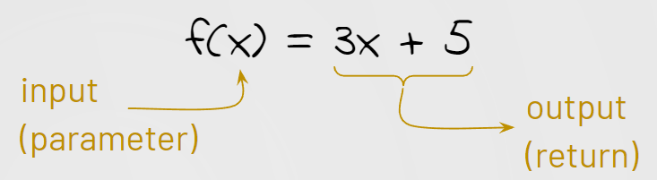

# 2.5 - Function Parameters and Return

##### ICS3 - Mr. J 🐧



**Missed the live demo? Read below or go straight to your task.**

- Prefer videos? Watch Parameters and Return.

## Part 1 - Parameters

**Notice `Math.floor(x)` takes a number, but `Math.random()` doesn't?**  
And `console.log()` can take many values.

These values are called _parameters_. They are the _inputs_ to a function. Here's an example:
```JS
function exponent(base, exp) {
    console.log(base ** exp);
}
```

☝🏻 `base` and `exp` are parameters. When calling `exponent`, you need to provide values:
```JS
exponent(5, 2);   // prints 25
exponent(10, 3);  // prints 1000
```

With parameters, you can customize functions:
```JS
rollDice(4, 6);    // Roll four 6-sided dice
randInt(-12, 12);  // Get a random number from -12 to 12
```

### 💻 Your Turn

In main.js, create a function `add3(num1, num2, num3)` that adds the values and prints the result. Test it in your dev console.

## Part 2 - Return

**Printing is useful, but how can we _use_ the value?**

`Math.sqrt(x)` returns the square root of a number:
```JS
let s = Math.sqrt(16);
console.log(s);  // prints 4
```

### 💻 Try it

In main.js, paste this:
```JS
function square(value) {
    return value ** 2;
}

let x = square(5);
console.log(x);  // prints 25
```

**Use the `return` keyword to provide an output:**
```JS
function square(value) {
    return value ** 2;
}
```

☝🏻 **Notes:**
- `return` stops the function.
- You can use `return` to exit the function without a value.

```JS
function useless(value) {
    return;
    console.log(value ** 2);  // This line will NEVER run
}
```

### 📝 Example with Parameters and Return:
```JS
function randInt(min, max) {
    return Math.floor(Math.random() * (max - min + 1)) + min;
}
```

---

**Now check out your task.**

🐧
